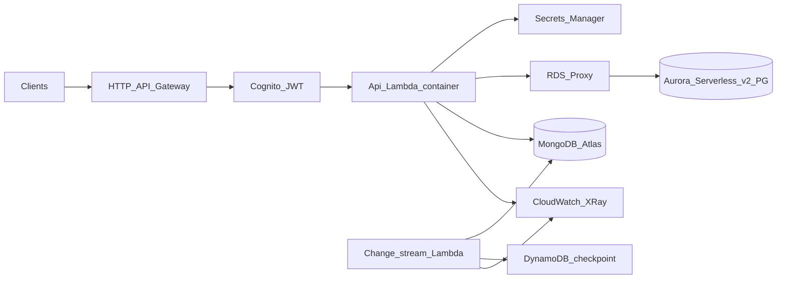

# NimbusTask

Production-style **serverless task management API** for portfolio and interview discussions: **AWS Lambda** (container image), **HTTP API Gateway**, **Amazon Cognito JWT** authorization, **Aurora Serverless v2 PostgreSQL** (relational teams/projects/users), **MongoDB Atlas** (task documents with indexes), **RDS Proxy**, **DynamoDB** checkpoints for MongoDB change streams, **AWS CDK** (TypeScript), **GitHub Actions** CI, optional **CodePipeline/CodeBuild** deploy pipeline, **k6** load tests, and **CloudWatch** alarms.

**Primary region:** `us-east-1` (N. Virginia — low latency to the North Carolina / Durham area; AWS has no Durham region).

## Architecture



- **PostgreSQL:** teams, memberships, projects (Drizzle ORM + migrations in [`apps/api/drizzle/0000_init.sql`](apps/api/drizzle/0000_init.sql)).
- **MongoDB:** `tasks` collection with compound indexes created at runtime ([`apps/api/src/services/tasks.ts`](apps/api/src/services/tasks.ts)).
- **Change streams:** scheduled Lambda processes the `tasks` change stream with resume tokens in DynamoDB ([`apps/api/src/change-stream-handler.ts`](apps/api/src/change-stream-handler.ts)).

OpenAPI: [`openapi/openapi.yaml`](openapi/openapi.yaml).

## Prerequisites

- **Node.js 20+**, **npm**
- **Docker** (for `cdk deploy` with Lambda container images)
- **AWS account**, **AWS CDK CLI** (`npm install -g aws-cdk`)
- **MongoDB Atlas** cluster (network access for your NAT egress IPs after deploy)
- **CDK bootstrap** in the target account/region: `cdk bootstrap aws://ACCOUNT/REGION`

## Local development

1. Copy [`.env.example`](.env.example) to `.env` and set `DATABASE_URL`, `MONGODB_URI`, and `DEV_LOCAL_AUTH=true`.
2. Apply Postgres DDL: `npm run migrate:pg`
3. Run the API: `npm run dev`  
   Use headers `X-Dev-User-Id` and optional `X-Dev-User-Email` instead of Cognito.

## Deploy (CDK)

From the repo root:

```bash
npm ci
npm run build
cd infra
npx cdk deploy NimbusStack
```

After deploy:

1. **Update the MongoDB secret** in AWS Secrets Manager (replace the placeholder Atlas URI JSON `{"uri":"..."}`).
2. **Allow Atlas network access** from your VPC NAT egress IPs (VPC console → NAT Gateway → Elastic IP → allow in Atlas IP Access List), or use Atlas VPC peering / Private Endpoint for production-style networking.
3. **Run Postgres init** against the **RDS Proxy** endpoint using the master secret (same JSON format as Lambda; set `POSTGRES_PROXY_HOST` to the proxy hostname when using the AWS-generated secret that points at the cluster hostname). For first-time schema, use [`scripts/run-pg-init.ts`](scripts/run-pg-init.ts) with `DATABASE_URL` built from the proxy host and credentials from Secrets Manager.

Outputs include **HttpApiUrl**, **UserPoolId**, **UserPoolClientId**, and secret ARNs.

### Optional: CodePipeline stack

Create a [CodeStar connection](https://docs.aws.amazon.com/dtconsole/latest/userguide/connections.html) to GitHub, then:

```bash
cd infra
npx cdk deploy NimbusPipelineStack \
  -c githubConnectionArn=arn:aws:codestar-connections:...:connection/... \
  -c githubRepo=YOUR_ORG/NimbusTask \
  -c githubBranch=main
```

The pipeline definition lives in [`infra/lib/pipeline-stack.ts`](infra/lib/pipeline-stack.ts). Tighten IAM on the CodeBuild role for real accounts.

## Load testing (k6)

Install [k6](https://k6.io/). The health route is unauthenticated:

```bash
export API_BASE_URL="https://YOUR_ID.execute-api.us-east-1.amazonaws.com"
k6 run loadtests/load.js
```

Stages ramp VUs to exercise **>2,000 requests/minute** class traffic; tune `stages` in [`loadtests/load.js`](loadtests/load.js) and watch **Lambda** and **API Gateway** metrics in CloudWatch.

## Teardown

```bash
cd infra
npx cdk destroy NimbusStack
```

Destroy **fails** if deletion protection or snapshots are retained; empty the S3 bootstrap bucket if needed. Remove Atlas IP rules you added for testing.

## Resume / interview framing

- **Serverless + containers:** API runs as a **container image** built by [`docker/Dockerfile`](docker/Dockerfile) (ECR asset from CDK).
- **Multi-DB:** Postgres for relational invariants; MongoDB for flexible task payloads, indexes, and **change streams** for async validation.
- **Ops:** **RDS Proxy** for connection pooling to Aurora; **Powertools** logging/metrics/tracing in Lambdas; **CloudWatch alarms** on Lambda errors and duration.
- **CI/CD:** **GitHub Actions** for PR quality gates; **CodePipeline + CodeBuild** optional for mainline deploys.
- **Honesty:** Quote **availability** and **latency** improvements only from **your own** CloudWatch/load-test results, not as universal SLAs.

## License

MIT — see [LICENSE](LICENSE).
