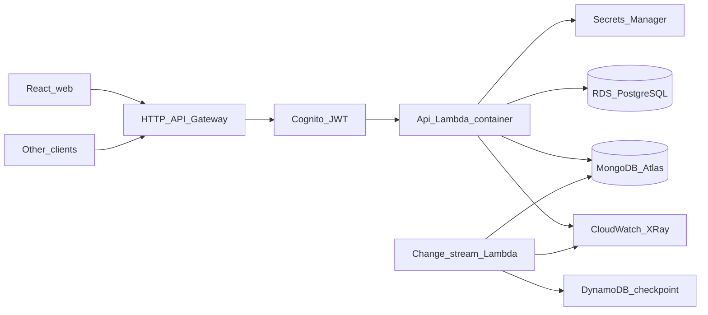

# NimbusTask

Production-style **serverless task management** stack: **AWS Lambda** (container image), **HTTP API Gateway**, **Amazon Cognito JWT**, **Amazon RDS PostgreSQL**, **MongoDB Atlas**, **DynamoDB** checkpoints for change streams, **AWS CDK**, **GitHub Actions** + optional **CodePipeline/CodeBuild**, **k6** load tests, **React** web UI, and **CloudWatch** alarms.

**Primary region:** `us-east-1` (N. Virginia — low latency to the North Carolina / Durham area; AWS has no Durham region).

**Suggested order:** finish local development, run **CI-quality checks** (`lint`, `test`, `build`), optionally run **k6** against a deployed API, then run **`cdk deploy` last** when you are ready to spend AWS resources. See [docs/PORTFOLIO_ALIGNMENT.md](docs/PORTFOLIO_ALIGNMENT.md) for a honest map between resume bullets and this repo.

## Architecture



- **PostgreSQL:** teams, memberships, projects (Drizzle + [`apps/api/drizzle/0000_init.sql`](apps/api/drizzle/0000_init.sql)). **Lambda → RDS** in a private subnet; optional **RDS Proxy** later via `POSTGRES_PROXY_HOST` if your account supports it.
- **MongoDB:** `tasks` collection + indexes ([`apps/api/src/services/tasks.ts`](apps/api/src/services/tasks.ts)); indexing and sharding **strategy** notes in [docs/DATA_LAYER.md](docs/DATA_LAYER.md).
- **Change streams:** scheduled Lambda + DynamoDB resume ([`apps/api/src/change-stream-handler.ts`](apps/api/src/change-stream-handler.ts)).

OpenAPI: [`openapi/openapi.yaml`](openapi/openapi.yaml).

## Prerequisites

- **Node.js 20+**, **npm**
- **Docker** (only for `cdk deploy` / Lambda container builds)
- **AWS account** + **CDK CLI** when you deploy (`npm install -g aws-cdk`)
- **MongoDB Atlas** (allow NAT egress after deploy)
- **CDK bootstrap** in target account/region: `cdk bootstrap aws://ACCOUNT/REGION`

## Local development — API

1. Copy [`.env.example`](.env.example) to `.env` and set `DATABASE_URL`, `MONGODB_URI`, and `DEV_LOCAL_AUTH=true`.
2. Apply Postgres DDL: `npm run migrate:pg`
3. Run the API: `npm run dev`  
   Use headers `X-Dev-User-Id` and optional `X-Dev-User-Email` instead of Cognito.

## Web UI (React)

From repo root:

```bash
npm ci
cd apps/web
cp .env.example .env
# Point VITE_API_URL at local API (e.g. http://localhost:3000) and set VITE_DEV_* for header auth, or set Cognito IDs for a deployed stack.
npm run dev
```

- **Local:** with `VITE_DEV_LOCAL_AUTH=true`, the UI sends dev headers matching the API dev server (no Cognito).
- **AWS:** set `VITE_USER_POOL_ID` and `VITE_USER_POOL_CLIENT_ID` from CDK outputs and sign in with a Cognito user (same region as the pool).

Build: `npm run build -w @nimbustask/web` (static files in `apps/web/dist` — deploy to S3/CloudFront or Amplify Hosting separately).

## Quality gates (before deploy)

Same commands as CI:

```bash
npm ci
npm run lint
npm run test
npm run build
```

Optional pipeline: [`infra/lib/pipeline-stack.ts`](infra/lib/pipeline-stack.ts) runs **lint → test → synth → cdk deploy** when you connect GitHub via CodeStar.

## Load testing (k6)

Install [k6](https://k6.io/). `/health` is unauthenticated:

```bash
export API_BASE_URL="https://YOUR_ID.execute-api.us-east-1.amazonaws.com"
k6 run loadtests/load.js
```

Peak stage targets **on the order of 2,000+ requests/minute** (see comments in [`loadtests/load.js`](loadtests/load.js)); confirm in k6 summary and CloudWatch.

## Resume / interview framing

- **Serverless + containers:** API image from [`docker/Dockerfile`](docker/Dockerfile).
- **Multi-DB:** Postgres + MongoDB; **change streams** for async validation paths.
- **CI/CD:** GitHub Actions + optional CodePipeline/CodeBuild; JWT via Cognito.
- **Honesty:** Availability %, latency %, and “50% faster deploys” need **your** metrics — see [docs/PORTFOLIO_ALIGNMENT.md](docs/PORTFOLIO_ALIGNMENT.md).

---

## Deploy (last step)

Use this when the app is ready and you accept AWS charges.

```bash
npm ci
npm run build
cd infra
npx cdk deploy NimbusStack
```

After deploy:

1. **MongoDB secret** in Secrets Manager — replace placeholder Atlas URI `{"uri":"..."}`.
2. **Atlas network access** — NAT Gateway Elastic IP on the allow list (or peering / Private Endpoint for production-style setups).
3. **Postgres schema** — build `DATABASE_URL` from the RDS secret (`host`, `port`, `username`, `password`, `dbname`) and run [`scripts/run-pg-init.ts`](scripts/run-pg-init.ts).

Stack outputs: **HttpApiUrl**, **UserPoolId**, **UserPoolClientId**, secret ARNs. Point the web app’s `VITE_*` variables at these values.

### Optional: CodePipeline stack

```bash
cd infra
npx cdk deploy NimbusPipelineStack \
  -c githubConnectionArn=arn:aws:codestar-connections:...:connection/... \
  -c githubRepo=YOUR_ORG/NimbusTask \
  -c githubBranch=main
```

Tighten IAM on the CodeBuild role for production accounts.

### Multi-region (repeat deploy)

See [docs/MULTI_REGION.md](docs/MULTI_REGION.md).

## Teardown

```bash
cd infra
npx cdk destroy NimbusStack
```

Resolve deletion protection / snapshots if needed; remove Atlas IP rules used for testing.

## License

MIT — see [LICENSE](LICENSE).
